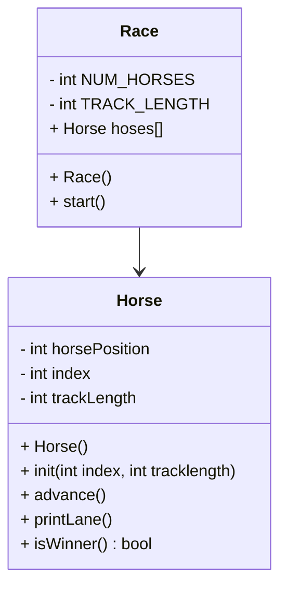

# OOP-Horse-Race

## UML




## Race::Race()
```
const int TRACK_LENGTH
const static int NUM_HORSES // This will be turned into an array

Create an array of horses length NUM_HORSES
Initialize all the horses
for each horse, initialize each horse with its index, an the track length
```

## Race::start()
```
seed random
bool keepGoing
while keepGoing is true:
    for loop through each horse:
        advance that horse
        print lane
        if horse has won:
            set keepGoing to false
```

## Horse::Horse() // constructor
```
int horsePosition = 0
int index = 0
int trackLength = 15
```

## void horse::init(int index, int trackLength) // initialize position of Horse
```
Horse::index = index
Horse::trackLength = trackLength
Horse::position = 0
```

## void Horse::advance() // move position of horse 50/50 chance
```
roll a random 0-1 int, put in coin
add coin to position -> position
```

## void Horse::printLane() 
```
for pos = 0 to trackLength:
    if Horse::position == pos:
        print Horse::index
    else:
        print '.'
print \n
```

## bool Horse::isWinner()
```
bool winner = false
if Horse::position >= trackLength:
    winner = true
    print horse has won
return winner
```
